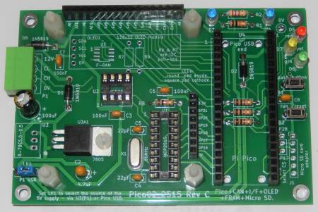

# MERG CBUS CANPicoWi Module

This repository contains firmware for the Raspberry PICO to build a module with a WiFi interface to CBUS.

The firmware is desiged to run on the PICO02 Rev C1 hardware, as designed by Ian Hart.

The PICO2 board should be fitted with a PICO-W module in order to provide WiFi support.  The board should also have the optional Micro-SD card slot fitted, and a "FAT" formatted SD card should be inserted into the slot containing the configuration file for the CANPicoWi.

An example configuration file can be found in the src/picowi folder of this repository.  The example file needs modifying to provide the correct WiFi SSID and password for connnecting to a WiFi router.

\note At this time the firmware only supports WiFi in Station Mode, it is planned to support WiFi in AP / hotspot mode later.

CANPicoWi is currently setup to only support the soft PIO based CAN interface, and as such the PICO02 board should be jumpered to bypass the CAN2515 or CAN2518 CAN controller.

A CAN2562 transceiver MUST be fitted to the PICO02 in order to communicate on CAN.
