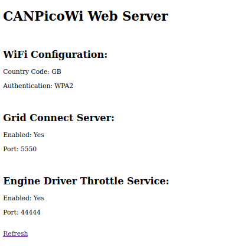

# CANPicoWi Web Server

CANPicoWi provides a basic Web Server on the default TCP Port 80. This Web Server displays the current configuration of the module, including the settings for WiFi, the Grid Connect server and Engine Driver throttle service.

You can view the Web Server by entering: "http://[ipaddr]" in your browsers search bar, e.g. "http://192.168.0.3"

\note
The CANPicoWi does not support secure connections, so ensure you enter http and not https.

 
| Previous                           |                          Next |
|:-----------------------------------|------------------------------:|
| [Configuration INI](config_ini.md) | [Node Variables](nodevars.md) |
 

